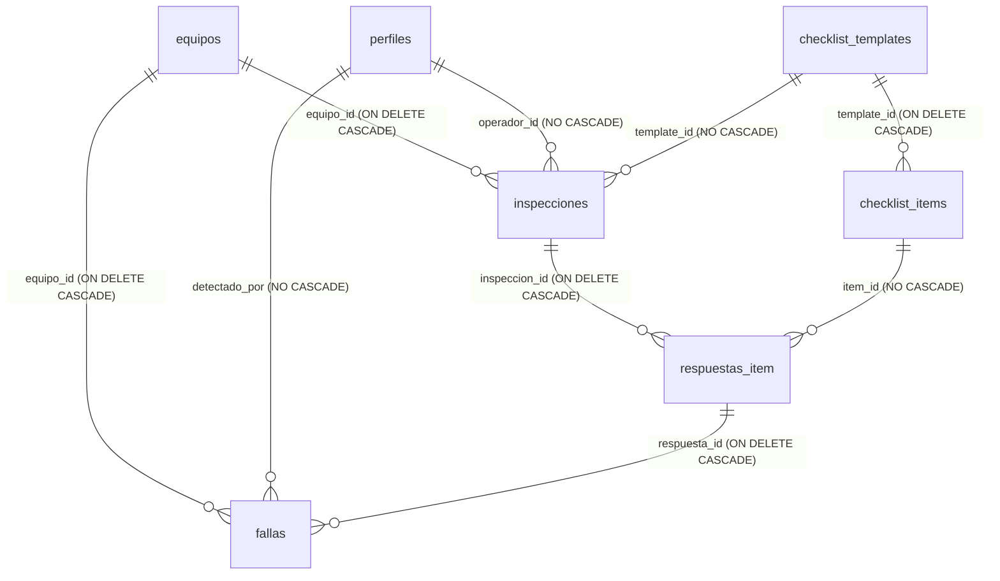

# Auditoría General Read-Only: Gestión de Autoelevadores por el Rol Supervisor
**Proyecto:** TPM Autoelevadores  
**Fecha:** 28 de Septiembre de 2026  
**Estado de la Auditoría:** FINALIZADA (READ-ONLY)  
**Alcance:** Flujos completos de Creación, Edición, Eliminación, Seguridad RLS, Consistencia Supabase / IndexedDB, Ciclo de vida del QR e Impacto en Historial.

---

## A. Resumen Ejecutivo

La presente auditoría analiza la gestión de flota de autoelevadores desde el perfil de **SUPERVISOR** (y personal de mantenimiento) en el proyecto **TPM Autoelevadores**. El análisis se realizó en modo estrictamente **READ-ONLY**, sin modificar código, sin alterar la base de datos, sin aplicar migraciones y sin realizar commits o pushes.

### Diagnóstico General
1. **Creación:** Implementada correctamente en el Dashboard (`/dashboard`). Las validaciones de obligatoriedad y unicidad (`interno`, `qr_codigo`) están respaldadas por restricciones `UNIQUE` a nivel de PostgreSQL. **Limitación:** No existe capacidad de creación offline.
2. **Edición:** Implementada en la UI del Dashboard. Permite actualizar atributos operativos (`marca`, `modelo`, `combustible`, `estado`, `horometro_actual`, `horometro_proximo_mantenimiento`). Los campos críticos `interno` y `qr_codigo` están protegidos en la UI modal de edición (no se exponen para edición), previniendo la rotura accidental de la vinculación con las placas QR físicas.
3. **Eliminación:** **PUNTO MÁS CRÍTICO DETECTADO.** Actualmente, la eliminación de un autoelevador ejecuta un `DELETE` físico directo en Supabase (`deleteEquipo`). Debido a la presencia de `ON DELETE CASCADE` en las claves foráneas de `inspecciones` y `fallas`, **la baja de un equipo purga permanentemente todo su historial de inspecciones, respuestas de checklist y fallas registradas**. Adicionalmente, las imágenes adjuntas en el bucket de Storage (`fallas-fotos`) quedan huérfanas sin ser eliminadas del almacenamiento.
4. **Seguridad y Autorización:** Excelente blindaje en el backend. Las operaciones directas sobre la tabla `equipos` (Insert, Update, Delete) están protegidas por políticas RLS en PostgreSQL (`equipos_admin_insert`, `equipos_admin_update`, `equipos_admin_delete`) utilizando la función con privilegios definidores `is_supervisor_or_maint()`. Cualquier intento de invocar estas operaciones desde un cliente anónimo u operador es rechazado por PostgreSQL.
5. **Consistencia Offline / IndexedDB:** La app cuenta con una arquitectura offline sólida para la realización de inspecciones (`inspecciones_queue` e `idempotencia`), pero la gestión administrativa de la flota (Crear/Editar/Eliminar) requiere conectividad activa con Supabase.

---

## B. Creación de Autoelevadores

### 1. Pantalla y Componente
- **Pantalla:** Console Supervisor (`/dashboard` -> Tab `Flota`).
- **Componente:** Modal `createModalOpen` en [app/dashboard/page.tsx](file:///c:/Users/herna/Desktop/PROYECTO%2020/app/dashboard/page.tsx#L883-L1042).
- **Función de API:** `createEquipo(...)` en [lib/api/tpm.ts](file:///c:/Users/herna/Desktop/PROYECTO%2020/lib/api/tpm.ts#L569-L607).

### 2. Campos y Validaciones
- **Campos Obligatorios:** `N° Interno` (validado en UI con atributo `required` y `.trim()`).
- **Generación de `qr_codigo`:** Si el supervisor no ingresa un código QR personalizado, la UI genera automáticamente la nomenclatura estándar `AE-` + número de interno a 2 dígitos (ej: `AE-05`).
- **Generación de ID:** El identificador único (`id`) es generado automáticamente por PostgreSQL mediante `gen_random_uuid()` (UUID v4).
- **Valores por Defecto:** `marca` ("Toyota"), `modelo` ("8FG25"), `combustible` ("GLP"), `horometro_actual` (0), `intervalo_mantenimiento_horas` (250 hs), `estado` ("operativo").

### 3. Manejo de Duplicados y Errores
- **Unicidad de `interno` y `qr_codigo`:** Respaldada por índices y restricciones de unicidad en Postgres:
  - `interno text not null unique`
  - `qr_codigo text unique not null`
- Si se intenta registrar un interno o QR existente, Supabase retorna el código de error `23505` (`unique_violation`). La función `createEquipo` captura la excepción y muestra una notificación flotante de error (`toast.error`).
- **Protección contra Doble Clic:** El formulario utiliza el estado `submittingForm` para deshabilitar el botón de envío durante la transacción.

### 4. Almacenamiento e Sincronización
- **Guardado Inicial:** Directo contra la tabla `equipos` de Supabase mediante PostgREST.
- **IndexedDB:** No se actualiza durante el envío, sino en la siguiente lectura general de la flota (`fetchEquipos()`), la cual invoca `saveEquiposCache()` refrescando el almacén `equipos_cache`.
- **Comportamiento Offline:** Si no hay conexión a internet, la creación falla inmediatamente y muestra el mensaje *"Supabase no está configurado"* o error de red. No existe cola offline para alta de equipos.

---

## C. Edición de Autoelevadores

### 1. Pantalla y Componente
- **Pantalla:** Console Supervisor (`/dashboard` -> Tab `Flota` -> Botón "Editar" en la tarjeta del equipo).
- **Componente:** Modal `editEquipo` en [app/dashboard/page.tsx](file:///c:/Users/herna/Desktop/PROYECTO%2020/app/dashboard/page.tsx#L1045-L1176).
- **Función de API:** `updateEquipo(id, updates)` en [lib/api/tpm.ts](file:///c:/Users/herna/Desktop/PROYECTO%2020/lib/api/tpm.ts#L609-L634).

### 2. Campos Editables vs Protegidos
- **Campos Editables en UI:** `marca`, `modelo`, `combustible`, `estado` (`operativo`, `observado`, `fuera_de_servicio`), `horometro_actual`, `horometro_proximo_mantenimiento`.
- **Campos Protegidos (No expuestos en el formulario):**
  - `id`: Inmutable.
  - `interno`: Omitido en la modal de edición UI para prevenir desajustes operativos.
  - `qr_codigo`: Omitido en la modal de edición UI para garantizar que las placas físicas impresas en los autoelevadores mantengan la dirección válida.

### 3. Impacto de Modificaciones en el Sistema
- **Inspecciones y Fallas Existentes:** Como las tablas `inspecciones` y `fallas` se vinculan mediante la clave primaria insensible a cambios `equipo_id` (UUID), la actualización de marca, modelo, combustible o estado no altera ni rompe las relaciones con el historial.
- **Edición Manual de Horómetro:** Si el supervisor edita el horómetro actual a un valor significativamente menor, no se rompe la integridad referencial, pero puede generar inconsistencias visuales en la bitácora histórica. La función RPC `registrar_inspeccion_completa` valida que las inspecciones futuras no ingresen valores decrecientes.
- **Actualización Local / IndexedDB:** La UI del Dashboard actualiza inmediatamente el estado de React (`setEquipos`). Sin embargo, el almacenamiento IndexedDB solo se actualiza cuando se vuelve a invocar `fetchEquipos()` en modo online.

---

## D. Eliminación de Autoelevadores

### 1. Análisis Técnico del Mecanismo de Baja
- **Botón de Baja:** Icono de papelera `<Trash2 />` en la tarjeta de cada autoelevador en `/dashboard`.
- **Visibilidad:** Restringida exclusivamente al rol supervisor/mantenimiento.
- **Componente Modal:** `deleteConfirmEquipo` en [app/dashboard/page.tsx](file:///c:/Users/herna/Desktop/PROYECTO%2020/app/dashboard/page.tsx#L1178-L1210).
- **Función de API:** `deleteEquipo(id)` en [lib/api/tpm.ts](file:///c:/Users/herna/Desktop/PROYECTO%2020/lib/api/tpm.ts#L636-L653).
- **Operación Ejecutada:** `DELETE FROM public.equipos WHERE id = id` (Supabase Client REST).

### 2. Comportamiento de las Claves Foráneas (Cascade vs Restrict)
En el esquema de la base de datos ([supabase/migrations/20260903000000_tpm_schema.sql](file:///c:/Users/herna/Desktop/PROYECTO%2020/supabase/migrations/20260903000000_tpm_schema.sql)):
- `inspecciones`: `equipo_id uuid references equipos(id) on delete cascade not null`
- `fallas`: `equipo_id uuid references equipos(id) on delete cascade not null`
- `respuestas_item`: `inspeccion_id uuid references inspecciones(id) on delete cascade not null`
- `fallas`: `respuesta_id uuid references respuestas_item(id) on delete cascade not null`

### 3. Consecuencias Críticas de la Eliminación Físicas
1. **Destrucción de Historial:** Al eliminar físicamente una fila de `equipos`, PostgreSQL ejecuta una eliminación en cascada en cadena (`ON DELETE CASCADE`). Se **borran permanentemente**:
   - Todas las inspecciones archivadas de ese autoelevador.
   - Todas las respuestas de checklist contestadas por los operadores.
   - Todas las fallas detectadas y sus estados de reparación.
2. **Archivos Huérfanos en Storage:** Las fotografías subidas al bucket `fallas-fotos` de Supabase Storage corresponden a URLs guardadas en la tabla `fallas`. Al eliminarse los registros en la base de datos, los archivos binarios de imagen permanecen almacenados en el bucket sin referencia alguna.
3. **No existe Eliminación Lógica (Soft Delete):** El esquema actual no cuenta con columnas como `activo boolean default true` o `deleted_at timestamptz`.

---

## E. Matriz de Seguridad y Autorización

| Operación | Protegido en UI (Frontend) | Protegido en Backend / Supabase RLS | Soporte Offline | Evaluación de Riesgo |
| --- | --- | --- | --- | --- |
| **Crear Equipo** | Sí (`rol === 'supervisor' \|\| 'mantenimiento'`) | **Sí** (`equipos_admin_insert` -> `is_supervisor_or_maint()`) | No (Requiere red) | **BAJO**. Control de acceso estricto a nivel de base de datos. |
| **Editar Equipo** | Sí (`rol === 'supervisor' \|\| 'mantenimiento'`) | **Sí** (`equipos_admin_update` -> `is_supervisor_or_maint()`) | No (Requiere red) | **BAJO**. Protegido por RLS. `qr_codigo` e `interno` no expuestos en la UI modal. |
| **Eliminar Equipo** | Sí (`rol === 'supervisor' \|\| 'mantenimiento'`) | **Sí** (`equipos_admin_delete` -> `is_supervisor_or_maint()`) | No (Requiere red) | **CRÍTICO**. La autorización es correcta, pero el mecanismo es un `DELETE` físico con `ON DELETE CASCADE` que elimina todo el historial. |

> **Evaluación de Superficie de Ataque Backend:**
> Si un operador autenticado o un usuario anónimo intenta realizar una llamada directa REST enviando una petición `DELETE`, `POST` o `PATCH` a la tabla `equipos` mediante la consola JavaScript o curl, PostgreSQL evalúa la función `public.is_supervisor_or_maint()`. Dado que su `auth.uid()` no posee el rol `supervisor` o `mantenimiento` en `public.perfiles`, la transacción es rechazada con un error de violación de RLS (`42501`). **El backend es 100% seguro contra bypass de UI.**

---

## F. Relaciones de la Base de Datos (Módulo Equipos)

### Detalle de Columnas y Restricciones de `public.equipos`:
- `id` (UUID, Primary Key, `gen_random_uuid()`)
- `interno` (Text, `NOT NULL`, `UNIQUE`)
- `marca` (Text, Nullable)
- `modelo` (Text, Nullable)
- `combustible` (Text, Nullable)
- `qr_codigo` (Text, `NOT NULL`, `UNIQUE`, Índice `idx_equipos_qr`)
- `horometro_actual` (Numeric, Default 0)
- `horometro_proximo_mantenimiento` (Numeric, Nullable)
- `intervalo_mantenimiento_horas` (Numeric, Default 250)
- `estado` (Text, Default `'operativo'`, Check: `'operativo'`, `'observado'`, `'fuera_de_servicio'`)
- `created_at` (Timestamptz, Default `now()`)

---

## G. Flujo del Código QR

1. **Generación y Registro:**
   - Durante la alta de un equipo, la UI asigna por defecto `AE-` + número de interno de 2 dígitos (ej: `AE-01`).
   - El valor se almacena en `equipos.qr_codigo` en mayúsculas y sin espacios.
2. **Uso en Rutas y Scanner:**
   - Al escanear una placa QR física o ingresar manualmente en la app, se redirige a `/equipo/[qr_codigo]`.
   - La página `app/equipo/[qr_codigo]/page.tsx` limpia el código con `extractEquipoCode()` e invoca `fetchEquipoByQR(cleanCode)`.
   - La consulta SQL utiliza coincidencia flexible: `.or('qr_codigo.ilike.${cleanCode},interno.eq.${cleanCode}')`.
3. **Estabilidad ante Ediciones:**
   - La UI Modal de edición no permite alterar el `qr_codigo`, asegurando que las placas físicas impresas permanezcan vinculadas.
4. **Comportamiento si se Elimina el Equipo:**
   - Si se da de baja un autoelevador, la consulta `fetchEquipoByQR` devuelve `null`.
   - La página `/equipo/[qr_codigo]` muestra un banner de error explícito *"Autoelevador no encontrado"*, impidiendo que el operador inicie inspecciones sobre un equipo inexistente.

---

## H. Arquitectura Offline y Sincronización

### 1. Creación, Edición y Eliminación de Equipos
- **Mecanismo:** Requieren conexión activa a Supabase.
- **Falta de Red:** No se encolan. Retornan un error de red inmediato y la UI informa la imposibilidad de procesar la solicitud offline.

### 2. Inspecciones y Checklist (Flujo Mixto Online/Offline)
- **Online:** Se ejecuta la función RPC atómica `registrar_inspeccion_completa(p_payload)` en PostgreSQL (transaccional, idempotente y con validación de horas de horómetro).
- **Offline:** La inspección se guarda en IndexedDB en la tienda `inspecciones_queue` mediante `enqueueInspeccion()`.
- **Sincronización:** Al recuperar la conectividad, `OfflineIndicator.tsx` procesa la cola llamando a `processOfflineQueue()`.
- **Caso Borde (Equipo Eliminado mientras estaba Offline):** Si un operador completa un checklist offline para el equipo `AE-01` y un supervisor lo elimina de Supabase antes de la reconexión:
  - Al sincronizar, la función RPC ejecuta `SELECT horometro_actual FROM equipos WHERE id = v_equipo_id`.
  - Al no encontrar el equipo, Postgres lanza la excepción `EQUIPO_NO_ENCONTRADO`.
  - La cola offline detecta que es un error fatal de validación (`isFatal: true`) y remueve la inspección de la cola local para evitar bucles infinitos de reintento.

---

## I. Matriz de Casos Borde

| Caso Borde | Estado | Tipo de Resultado | Descripción / Evidencia |
| --- | --- | --- | --- |
| **Crear con QR duplicado** | Verificado en Código | **Manejado** | Inserción rechazada por restricción `UNIQUE` en Postgres. Capturado por `createEquipo` y notificado en UI. |
| **Crear con Interno duplicado** | Verificado en Código | **Manejado** | Inserción rechazada por restricción `UNIQUE` en Postgres. Capturado por `createEquipo` y notificado en UI. |
| **Crear sin conexión** | Verificado en Código | **Manejado** | Falla inmediatamente con notificación de falta de red. No corrompe IndexedDB. |
| **Doble clic en guardar (Crear/Editar)** | Verificado en Código | **Manejado** | Estado `submittingForm` deshabilita el botón de submit de forma inmediata. |
| **Editar mientras se está offline** | Verificado en Código | **Manejado** | Error devuelto por API. No hay cola offline para edición. |
| **Eliminar equipo con historial de inspecciones** | Verificado en Código | **RIESGO CRÍTICO DETECTADO** | `ON DELETE CASCADE` borra irrevocablemente todas las inspecciones y fallas de la base de datos. |
| **Eliminar equipo con fallas abiertas** | Verificado en Código | **RIESGO ALTO DETECTADO** | Se eliminan las fallas sin verificar si están pendientes de reparación o abiertas. |
| **Eliminar equipo y escanear QR antiguo** | Verificado en Código | **Manejado** | Muestra pantalla de *"Autoelevador no encontrado"*. No revienta la aplicación. |
| **Subida de fotos de fallas al eliminar equipo** | Verificado en Código | **RIESGO MEDIO DETECTADO** | Las imágenes subidas a Supabase Storage no se borran y quedan huérfanas en el bucket `fallas-fotos`. |

---

## J. Hallazgos y Clasificación de Riesgos

### 1. HALLAZGO CRÍTICO
- **Título:** Eliminación Física de Equipos con Borrado Irrevocable en Cascada de Historial (`ON DELETE CASCADE`).
- **Ubicación:** 
  - API: `deleteEquipo` en [lib/api/tpm.ts](file:///c:/Users/herna/Desktop/PROYECTO%2020/lib/api/tpm.ts#L636-L653)
  - Esquema DB: [supabase/migrations/20260903000000_tpm_schema.sql](file:///c:/Users/herna/Desktop/PROYECTO%2020/supabase/migrations/20260903000000_tpm_schema.sql#L50)
- **Evidencia:**  
  `inspecciones` y `fallas` definen `equipo_id uuid references equipos(id) on delete cascade`. La función `deleteEquipo` ejecuta `.delete().eq('id', id)`.
- **Impacto:**  
  Un supervisor puede borrar un autoelevador por error o por darlo de baja operativa, destruyendo permanentemente todo el registro de auditoría legal e industrial (checklists diarios, horómetros pasados y reportes de seguridad).
- **Condición para Reproducirlo:**  
  Ingresar al Dashboard como supervisor, ir a la pestaña Flota y confirmar la eliminación de un equipo con inspecciones previas.
- **Recomendación (Para etapas futuras de desarrollo):**  
  Implementar **Soft Delete** (eliminación lógica) agregando la columna `activo boolean default true` o `deleted_at timestamptz` a la tabla `equipos`, y modificar `deleteEquipo` para que ejecute una actualización de estado en lugar de un `DELETE` físico.

---

### 2. HALLAZGO ALTO
- **Título:** Acumulación de Fotografías Huérfanas en Supabase Storage tras Eliminación de Equipos o Fallas.
- **Ubicación:** 
  - Bucket: `fallas-fotos`
  - Migración: [supabase/migrations/20260911_harden_rls_and_storage.sql](file:///c:/Users/herna/Desktop/PROYECTO%2020/supabase/migrations/20260911_harden_rls_and_storage.sql#L228)
- **Evidencia:**  
  PostgreSQL no gestiona la eliminación de objetos en el almacenamiento de Supabase Storage. Al borrarse las filas de la tabla `fallas`, las imágenes cargadas permanecen consumiendo almacenamiento.
- **Impacto:**  
  Desperdicio ineficiente de cuota de almacenamiento en Supabase Storage y desperdicio de recursos.
- **Condición para Reproducirlo:**  
  Eliminar un autoelevador o fallas que contengan fotos adjuntas.
- **Recomendación:**  
  Crear una función Trigger en PostgreSQL o un script de limpieza para eliminar los objetos correspondientes en `storage.objects` al remover una falla.

---

### 3. HALLAZGO MEDIO
- **Título:** Inexistencia de Cola Offline para Operaciones Administrativas de Flota (Crear/Editar/Eliminar).
- **Ubicación:** 
  - [lib/api/tpm.ts](file:///c:/Users/herna/Desktop/PROYECTO%2020/lib/api/tpm.ts#L579)
- **Evidencia:**  
  `createEquipo`, `updateEquipo` y `deleteEquipo` comprueban si la red/Supabase está disponible y devuelven un error inmediato si no hay conectividad.
- **Impacto:**  
  El supervisor no puede dar de alta ni editar equipos si se encuentra en un sector de la planta sin cobertura de red.
- **Condición para Reproducirlo:**  
  Intentar agregar o editar un autoelevador sin conexión a internet.
- **Recomendación:**  
  Evaluar si la administración de flota requiere sincronización diferida u obligar a que se realice únicamente en zonas con conectividad Wi-Fi/4G.

---

### 4. HALLAZGO BAJO
- **Título:** Caché IndexedDB de Flota (`equipos_cache`) Desactualizada de Forma Temporal tras Ediciones.
- **Ubicación:** 
  - [lib/offline/plant-cache.ts](file:///c:/Users/herna/Desktop/PROYECTO%2020/lib/offline/plant-cache.ts#L29-L48)
- **Evidencia:**  
  Al editar un equipo mediante `updateEquipo`, se actualiza Supabase y el estado en memoria de React, pero no se reescribe el registro específico en IndexedDB hasta que se ejecuta un `fetchEquipos()` completo.
- **Impacto:**  
  Si el usuario edita un equipo e inmediatamente pierde la conexión sin recargar la página, una posterior lectura offline mostrará los datos anteriores.
- **Condición para Reproducirlo:**  
  Editar un equipo online, cortar inmediatamente la conexión a internet y recargar la aplicación en modo offline.
- **Recomendación:**  
  Actualizar `equipos_cache` en IndexedDB dentro de `updateEquipo` tras recibir confirmación exitosa de Supabase.

---

## K. Archivos Relevantes Auditados

1. **Gestión de Flota (UI y Lógica):**
   - [app/dashboard/page.tsx](file:///c:/Users/herna/Desktop/PROYECTO%2020/app/dashboard/page.tsx)
   - [app/equipo/[qr_codigo]/page.tsx](file:///c:/Users/herna/Desktop/PROYECTO%2020/app/equipo/%5Bqr_codigo%5D/page.tsx)
   - [lib/api/tpm.ts](file:///c:/Users/herna/Desktop/PROYECTO%2020/lib/api/tpm.ts)
2. **Seguridad y Autorización:**
   - [lib/api/auth.ts](file:///c:/Users/herna/Desktop/PROYECTO%2020/lib/api/auth.ts)
   - [middleware.ts](file:///c:/Users/herna/Desktop/PROYECTO%2020/middleware.ts)
   - [lib/supabase/middleware.ts](file:///c:/Users/herna/Desktop/PROYECTO%2020/lib/supabase/middleware.ts)
3. **Esquema de Base de Datos y Políticas RLS:**
   - [supabase/migrations/20260903000000_tpm_schema.sql](file:///c:/Users/herna/Desktop/PROYECTO%2020/supabase/migrations/20260903000000_tpm_schema.sql)
   - [supabase/migrations/20260909_apply_rls_and_storage.sql](file:///c:/Users/herna/Desktop/PROYECTO%2020/supabase/migrations/20260909_apply_rls_and_storage.sql)
   - [supabase/migrations/20260910173000_atomic_inspections_and_idempotency.sql](file:///c:/Users/herna/Desktop/PROYECTO%2020/supabase/migrations/20260910173000_atomic_inspections_and_idempotency.sql)
   - [supabase/migrations/20260911_harden_rls_and_storage.sql](file:///c:/Users/herna/Desktop/PROYECTO%2020/supabase/migrations/20260911_harden_rls_and_storage.sql)
4. **Modo Offline e IndexedDB:**
   - [lib/offline/db.ts](file:///c:/Users/herna/Desktop/PROYECTO%2020/lib/offline/db.ts)
   - [lib/offline/queue.ts](file:///c:/Users/herna/Desktop/PROYECTO%2020/lib/offline/queue.ts)
   - [lib/offline/plant-cache.ts](file:///c:/Users/herna/Desktop/PROYECTO%2020/lib/offline/plant-cache.ts)
   - [components/OfflineIndicator.tsx](file:///c:/Users/herna/Desktop/PROYECTO%2020/components/OfflineIndicator.tsx)

---

## L. Estado Técnico y Confirmación de Garantías

### 1. Verificaciones Ejecutadas
- `npm run check`: **Exitoso (Exit 0)**. El compilador de TypeScript (`tsc --noEmit`) no detectó errores de tipos.
- `git diff --check`: **Exitoso (Exit 0)**. Sin espacios ni líneas en blanco defectuosas.
- `git status`: **Limpio (Clean)**.

### 2. Declaración Explícita de Cumplimiento
- **NO se modificó ningún archivo de código del proyecto.**
- **NO se modificó la base de datos de producción ni de desarrollo.**
- **NO se ejecutaron operaciones destructivas (`INSERT`, `UPDATE`, `DELETE`) en la base de datos.**
- **NO se crearon ni ejecutaron nuevas migraciones.**
- **NO se realizó ninguna operación `git commit`.**
- **NO se realizó ninguna operación `git push`.**
