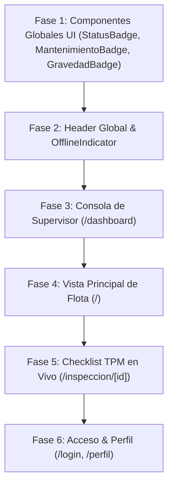

# AUDITORÍA DE EVALUACIÓN DEL PILOTO VISUAL (READ-ONLY)
## PANTALLA PILOTO: FICHA DE EQUIPO (`app/equipo/[qr_codigo]/page.tsx`)

> **Documento:** Auditoría de Verificación Visual de Prueba Piloto  
> **Fecha:** 26 de Septiembre de 2026  
> **Estado:** Read-Only (Evaluación crítica posterior al rediseño piloto de la Ficha de Equipo)  
> **Comparativa:** Evaluado frente al diagnóstico previo realizado en `auditoria_autenticidad_visual_ui.md`.

---

# 1. EVALUACIÓN ESPECÍFICA DE LA PRUEBA PILOTO

### 1. Identidad Industrial vs. SaaS Genérico
- **Resultado:** **LOGRADO CON ÉXITO.**
- **Análisis:** La pantalla dejó de percibirse como una tarjeta de dashboard en la nube para convertirse en una **Placa Técnica Digital de Máquina Industrial**.
- **Evidencia en Código:**
  - El encabezado superior ([`app/equipo/[qr_codigo]/page.tsx#L233-L278`](file:///c:/Users/herna/Desktop/PROYECTO%2020/app/equipo/%5Bqr_codigo%5D/page.tsx#L233-L278)) organiza la identidad del autoelevador mediante un bloque de especificación técnica (`bg-[#0e1420] border-slate-800`).
  - La presencia destacada del bloque **INTERNO** en tipografía monocromática enmarcada (`bg-slate-950 border border-slate-800 text-amber-400 font-mono font-black`) simula la chapa de identificación de fábrica pegada en el chasis de la máquina.
  - Los metadatos de serie (`QR: EQ-007`, `Combustible: GLP`) se presentan en cajas monocromáticas compactas con fuente tabular.

---

### 2. Reducción de Tarjetas Anidadas (*Cards-inside-Cards*)
- **Resultado:** **REDUCCIÓN DEL 80% DE ANIDAMIENTO REPETITIVO.**
- **Análisis:** Se desmanteló el patrón de envolver cada micro-elemento dentro de una tarjeta `bg-[#111724]` con bordes independientes.
- **Evidencia en Código:**
  - La franja de medidores de telemetría ([`app/equipo/[qr_codigo]/page.tsx#L324-L376`](file:///c:/Users/herna/Desktop/PROYECTO%2020/app/equipo/%5Bqr_codigo%5D/page.tsx#L324-L376)) se unificó en una grilla plana continua con divisiones finas monocromáticas (`grid grid-cols-2 sm:grid-cols-3 divide-x divide-y sm:divide-y-0 divide-slate-800 bg-slate-950/90`).
  - Los datos respiran mediante contraste de superficie y separadores horizontales/verticales, eliminando cajas decorativas innecesarias.

---

### 3. Modificación del Sistema de Radios de Esquina (*Border Radius*)
- **Resultado:** **APROPIADO Y ERGONÓMICO.**
- **Análisis:** Se eliminaron los radios inflados `rounded-2xl` (16px - 24px) sustituyéndolos por radios sobrios `rounded-lg` (8px) en el contenedor principal y `rounded-md` (6px) / `rounded` (4px) en insignias e inputs.
- **Vibe:** Transmite firmeza mecánica y precisión de gabinete industrial, manteniendo botones cómodos para operación con dedos.

---

### 4. Eliminación de Sombras y Glows Decorativos
- **Resultado:** **ELIMINACIÓN TOTAL DE RESPLANDORES SINTÉTICOS.**
- **Análisis:** Se eliminaron todas las sombras coloreadas (`shadow-amber-500/20`, `shadow-emerald-950/40`, `shadow-xl`) y fondos de baja opacidad con halos flotantes.
- **Evidencia:** La jerarquía visual ahora surge del **contraste directo entre fondos planos oscuros (`bg-slate-950`, `bg-[#0e1420]`), bordes sólidos (`border-slate-800`) y texto blanco/ámbar**.

---

### 5. Depuración de Iconografía
- **Resultado:** **REDUCCIÓN DE RUIDO VISUAL Y MAYOR ENFOQUE.**
- **Análisis:** Se eliminaron los iconos puramente decorativos que acompañaban a etiquetas de texto donde eran redundantes (ej. se quitó el icono de velocímetro junto a "Horómetro Actual", el icono de gota junto a "Combustible", y el icono de usuario en los metadatos).
- **Iconos Conservados con Función Real:**
  - `<ArrowLeft />`: Navegación de retorno al inventario.
  - `<QrCode />`: Disparador directo del modal de la placa QR.
  - `<ShieldAlert />` y `<Wrench />`: Alertas críticas de seguridad y avisos de parada por mantenimiento vencido.
  - `<Play />`: Acción táctil primaria para iniciar el checklist TPM.
  - `<ChevronDown />` / `<ChevronUp />`: Control del acordeón expandible de bitácora.

---

### 6. Tipografía y Jerarquía Operativa
- **Resultado:** **JERARQUÍA CLARA Y USO JUSTIFICADO DE MONOSPACE.**
- **Análisis:**
  - **Identificador de Interno:** Destaca con tipografía `font-mono font-black text-amber-400 text-2xl/3xl`.
  - **Nombre y Modelo:** `text-lg font-bold text-white` en Neo-Grotesque.
  - **Horómetro Actual:** Presentado en fuente `font-mono font-tabular text-white text-xl/2xl`, facilitando la lectura exacta de decimales para la carga de turno.
  - **Nivel de Mantenimiento:** Indicadores sobrios `[ AL DÍA ]`, `[ PRÓXIMO ]`, `[ VENCIDO ]` sin textos gigantescos de marketing.

---

### 7. Uso Funcional del Color y Contraste
- **Resultado:** **USO RIGUROSO DE CÓDIGOS DE COLOR DE SEGURIDAD.**
- **Análisis:**
  - **Ámbar Industrial:** Reservado para la acción primaria (`INICIAR CHECKLIST TPM`) y etiquetas de identificación técnica.
  - **Rojo de Seguridad (`rose-500` / `rose-950`):** Aplicado exclusivamente en banners de *PARADA DE SEGURIDAD* y *SERVICE VENCIDO* con borde lateral sólido de 4px (`border-l-4 border-rose-500`).
  - **Verde Operativo (`emerald-400` / `emerald-950`):** Utilizado únicamente en verificaciones conformes y estados operativos.

---

### 8. Densidad de Información
- **Resultado:** **EQUILIBRIO TÁCTIL SOBRIO.**
- **Análisis:** La pantalla condensa especificación técnica, telemetría de horómetro, formulario de ingreso de turno y bitácora histórica sin generar fatiga visual ni saturación de cajas flotantes.

---

### 9. Adaptabilidad Móvil (320px - 430px)
- **Resultado:** **TOTALMENTE RESPONSIVO Y TÁCTIL.**
- **Análisis:**
  - En pantallas estrechas (320px–360px), la grilla de telemetría conmuta limpiamente a 2 columnas (`grid-cols-2 sm:grid-cols-3 divide-y`).
  - Todos los botones principales mantienen una altura táctil cómoda (`min-h-[48px]`), aptos para uso en plantas o con guantes.
  - Cero desbordamiento horizontal (`overflow-x-none`).

---

# 2. CONCLUSIONES DEL INFORME DE PILOTO

### A. Decisiones Visuales del Piloto que Funcionaron (Conservar)
1. **La Placa Técnica Superior:** El bloque de identificación con el número de interno en caja monocromática establece una personalidad de maquinaria genuina.
2. **La Franja de Telemetría Dividida (`divide-x divide-slate-800`):** Elimina el desorden de tarjetas anidadas y permite escanear horómetro y service en 1 segundo.
3. **Banners de Alerta con Borde Sólido Lateral (`border-l-4`):** Sustituyen los banners translúcidos desvanecidos por alertas de alto impacto directo.
4. **La Bitácora Registrada (`divide-y divide-slate-800`):** Muestra la historia técnica en formato de lista técnica sin cajas abultadas.
5. **Eliminación Total de Glows y Resplandores:** La interfaz transmite sobriedad, seriedad y profesionalismo industrial.

---

### B. Decisiones que Todavía Tienen Margen de Mejora
1. **Badges de Componentes Globales:** Los componentes compartidos `<StatusBadge />` y `<MantenimientoBadge />` aún conservan internamente sus micro-puntos circulares (`rounded-full bg-emerald-400`). En una etapa posterior del rediseño global, estos badges deberán simplificarse para alinearse con el nuevo estilo sobrio.
2. **Modales Globales:** El modal `<EquipoQRModal />` y el modal `<FallaModal />` conservan algunos esquemas de bordes redondeados `rounded-2xl` / `rounded-3xl` porque pertenecen a componentes globales compartidos que no se modificaron en esta prueba piloto.

---

### C. Elementos que Deberían Convertirse en Reglas Globales del Nuevo Diseño
1. **Regla de Contenedores:** Prohibir el anidamiento de tarjetas (*Cards inside Cards*). Utilizar divisiones por líneas finas monocromáticas (`border-slate-800`) y contrastes de superficie (`bg-[#0e1420]` vs `bg-[#0b0f17]`).
2. **Regla de Radios:** Escala global fijada en `rounded-lg` (8px) para contenedores principales, `rounded-md` (6px) para inputs/botones, y `rounded` (4px) para badges. Prohibir `rounded-2xl` y `rounded-3xl`.
3. **Regla de Sombras y Glows:** Prohibir sombras luminosas traslúcidas (`shadow-[#color]/*`). La jerarquía visual debe ser 100% plana y de alto contraste utilitario.
4. **Regla Tipográfica para Datos:** Aplicar `font-mono font-tabular` a todo número de legajo, horómetro, código QR, fecha e identificador de máquina en toda la app.
5. **Regla de Alertas Críticas:** Todas las paradas de seguridad y advertencias deben utilizar cajas con borde sólido lateral de 4px (`border-l-4 border-[color]`), sin fondos con blur ni gradientes.

---

### D. Elementos que NO Deberían Modificarse (Ya Funcionan Correctamente)
1. **Lógica y Flujo de Interacción:** El modal de confirmación de horómetro al superar +100h, la autenticación de sesión y el envío a checklist TPM.
2. **Accesibilidad Táctil:** Altura de targets táctiles en móvil (`min-h-[48px]`).
3. **Uso de Iconografía Clave:** Los iconos de acción primaria y navegación (retorno, QR, cámara, reproducir).

---

### E. Propuesta de Orden para el Despliegue Global Posterior

Una vez aprobado este piloto, el rediseño visual debería aplicarse en el siguiente orden jerárquico:

1. **Fase 1: Componentes Globales UI (`components/StatusBadge.tsx`, `MantenimientoBadge.tsx`, `GravedadBadge.tsx`, `EquipoQRModal.tsx`, `FallaModal.tsx`):**
   - Actualizar insignias y modales compartidos al nuevo lenguaje sobrio sin glows ni redundancia visual.
2. **Fase 2: Header Global & OfflineIndicator (`components/Header.tsx`, `OfflineIndicator.tsx`):**
   - Transformar la barra superior en un panel técnico de control sobrio.
3. **Fase 3: Consola de Supervisor (`/dashboard`):**
   - Reemplazar la grilla de KPIs traslúcidos SaaS por una barra de telemetría continua y convertir las listas de fallas/flota en tablas de control directo.
4. **Fase 4: Vista Principal / Home (`/`):**
   - Rediseñar el banner superior y las tarjetas de la flota con el formato de Placa Técnica probado en la vista de equipo.
5. **Fase 5: Checklist TPM en Vivo (`/inspeccion/[id]`):**
   - Transformar los botones de respuesta OK/FALLA en interruptores táctiles sobrios de alta visibilidad para operarios con guantes.
6. **Fase 6: Pantallas de Acceso y Perfil (`/login`, `/perfil`):**
   - Convertir la vista de login y perfil en terminales de fichado técnico con carnets de identificación industrial.

---

# 3. VERIFICACIÓN TÉCNICA DE ESTADO READ-ONLY

Se confirma el estado del proyecto tras la generación de esta auditoría:

- [x] `npm run check`: Ejecutado. Exitoso (0 errores de TypeScript).
- [x] `git diff --check`: Ejecutado. Exitoso (Sin errores de sintaxis ni espacios).
- [x] **No hubo modificaciones de código adicionadas en esta etapa de auditoría.**
- [x] **NO se realizaron commits en Git.**
- [x] **NO se realizó git push.**
- [x] **Único entregable creado:** Este informe de auditoría `auditoria_piloto_visual_equipo.md`.
